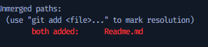

1. Make directory
2. masuk ke dir baru
3. git init
4. git config user.name isiin username GitHub
5. git config user.email email GitHub
6. git checkout -b main

Project:
1. create repository baru
2. bikin file baru
3. modify existing file
4. create branch baru : 'git checkout -b add/file'
5. add new file ke staging: 'git add .' atau 'git add nma_file1 nama_file2'
6. commit branch baru: 'git commit -m "adding readme file"
7. lihat log: 'git log -n2' '-n': untuk mendefinisikan banyak log commit id yang mau dilihat
8. Menyimpan perubahan ke stash sementara karena masih WIP(work in progress): 'git stash'
9. Pindah branch dari add/file ke main:
    -'git checkout main' (branch main baru)
    -'git checkout main ('untuk yang udah ada branch main-nya')
10. kembalikan stash WIP: 'git stash pop'
11. Tambahkan beberapa line di test.txt
12. 'git add test.txt'
13. Commit perubahan di test.txt: 'git commit -m "menambahkan beberapa lines"
14. Melihat perubahan line di file Readme.md: 'git diff Readme.md'
15. Add Readme.md ke staging: 'git add Readme.md'
16. Commit perubahan di Readme.md: 'git commit -m "menambahkan step git"
17. Melihat log lebih simple: git log --oneline
18. Checkout main: 'git checkout main'
19. Bikin branch baru dari main: 'git checkout add/features'
20. Add some lines ke Readme.md
21. Git add Reame.md: git add Readme.md
22. Commit Readme.md: git add Readme.md lalu 'git commit -m "add failed line"
23. Merge add/features branch ke add/file:
    -'git checkout add/file'
    -'git merge add/features'
24. push branch baru ke remote
25. Create Repository di Github
26. Copy url repository di Github
27. Check remote list: 'git remote -v'
28. Add remote to local repository: 'git remote add origin <remote-url>
29. Pastikan remotenya udah ada: 'git remote -v'
30. git push ke remote: 'git push origin add/file'
31. Create Pull Request
32. merge branch baru itu ke main
line 33
line 32

Resolve conflict:
Kalau terjadi conflict seperti gambar di bawah ini:

Yang perlu kita lakukan:

Diskusikan dengan team mates mana yang bener
Apakah accept both changes, incoming changes, current changes
Klik salah satu antara ketiga pilihan itu
save file
git status: untuk melihat status git repository

git add Readme.md
git commit -m "message"
git push origin nama-branch